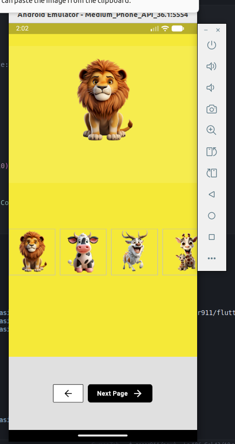
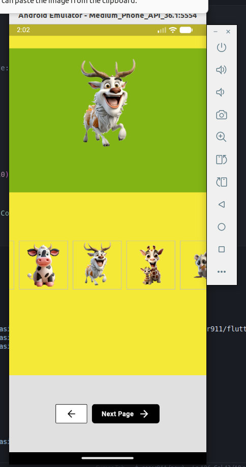
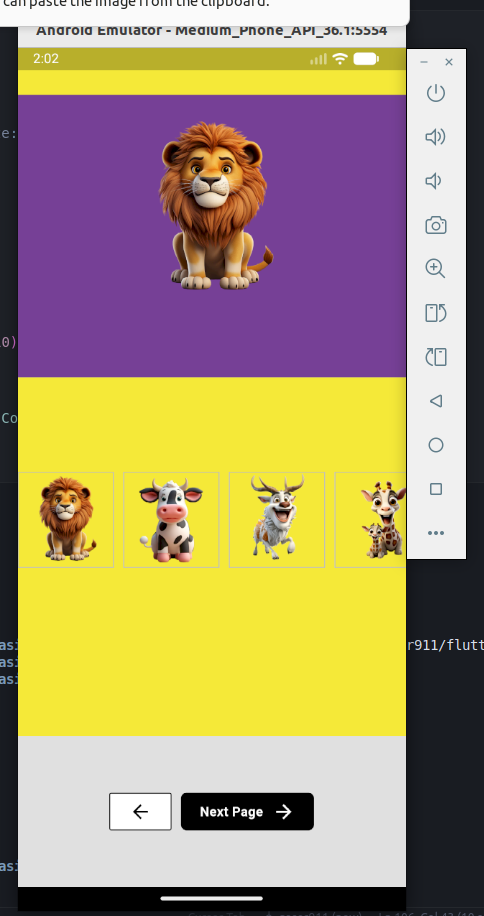
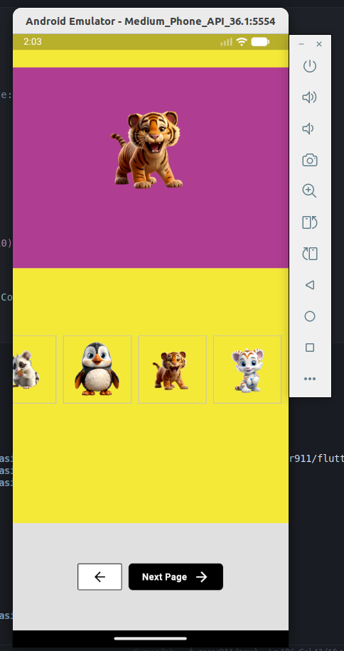
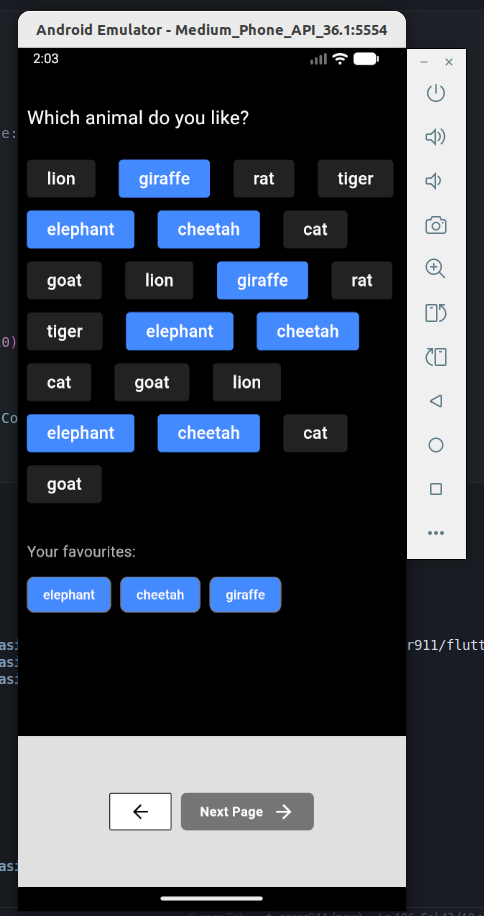
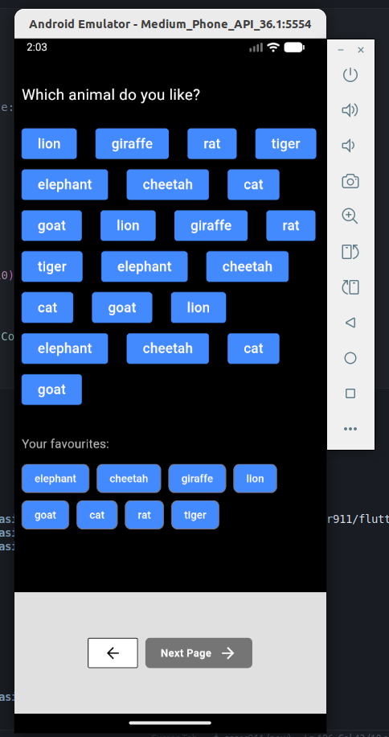
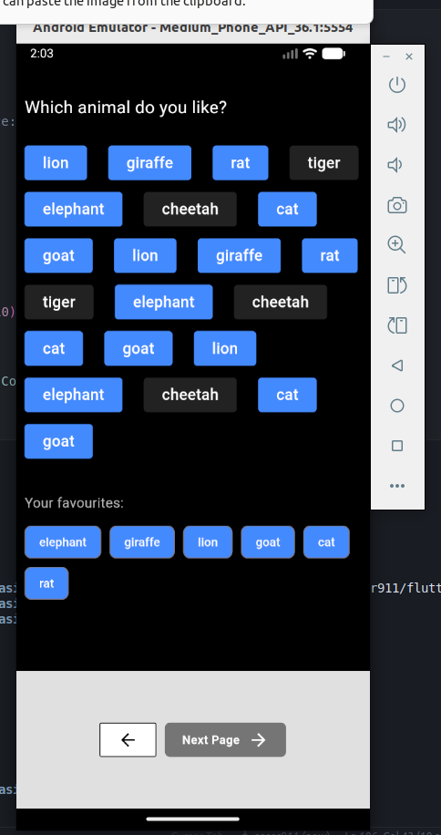
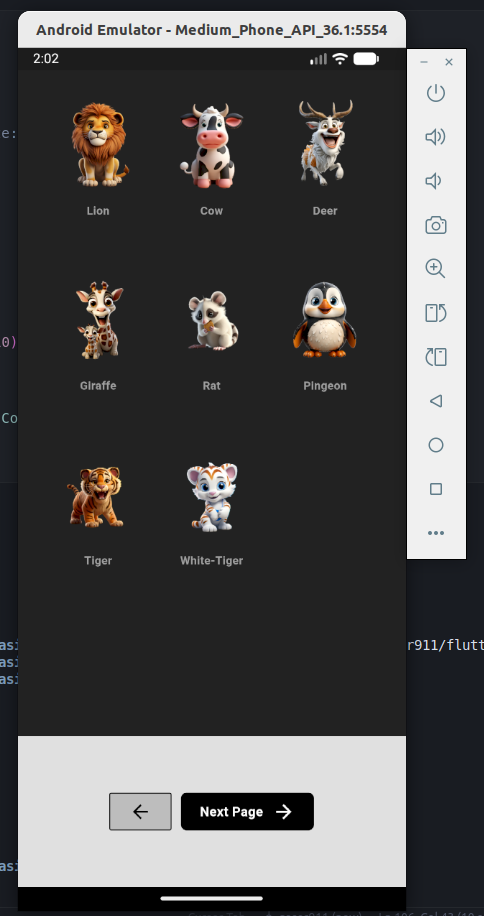
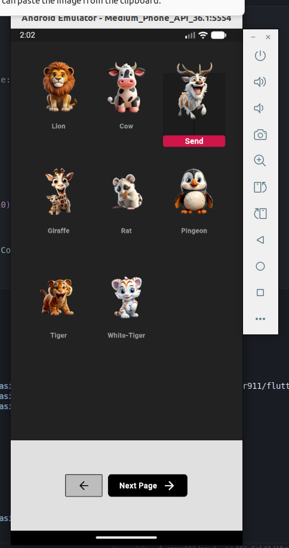

# basics
This project is applying on the basics flutter logic 

# 🧠 Flutter Basics

This project applies the basic Flutter logic.

It includes **single** and **multi-selection** functionality with simple animations —  
covering the core tap and selection features in Flutter.

---

## 📸 Screenshots

<p align="center">
  
  
  
  
</p>

<p align="center">
  
  
  
</p>

<p align="center">
  
  
</p>

---

## 🚀 How to Run

1. Clone this repository  
   ```bash
   git clone https://github.com/gaser911/flutter_selection_basics.git
